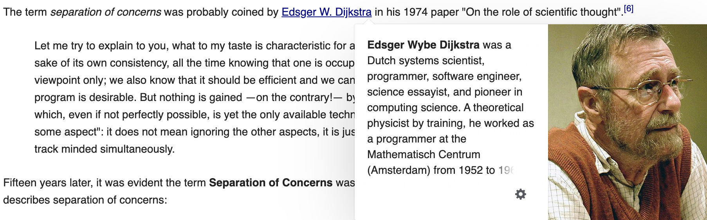
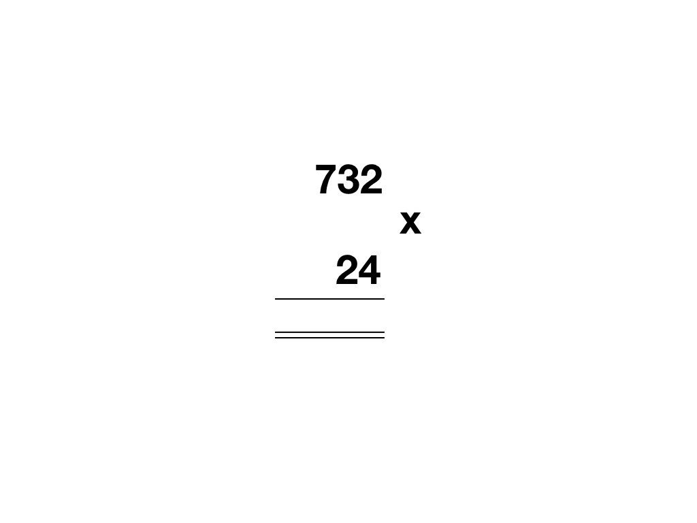
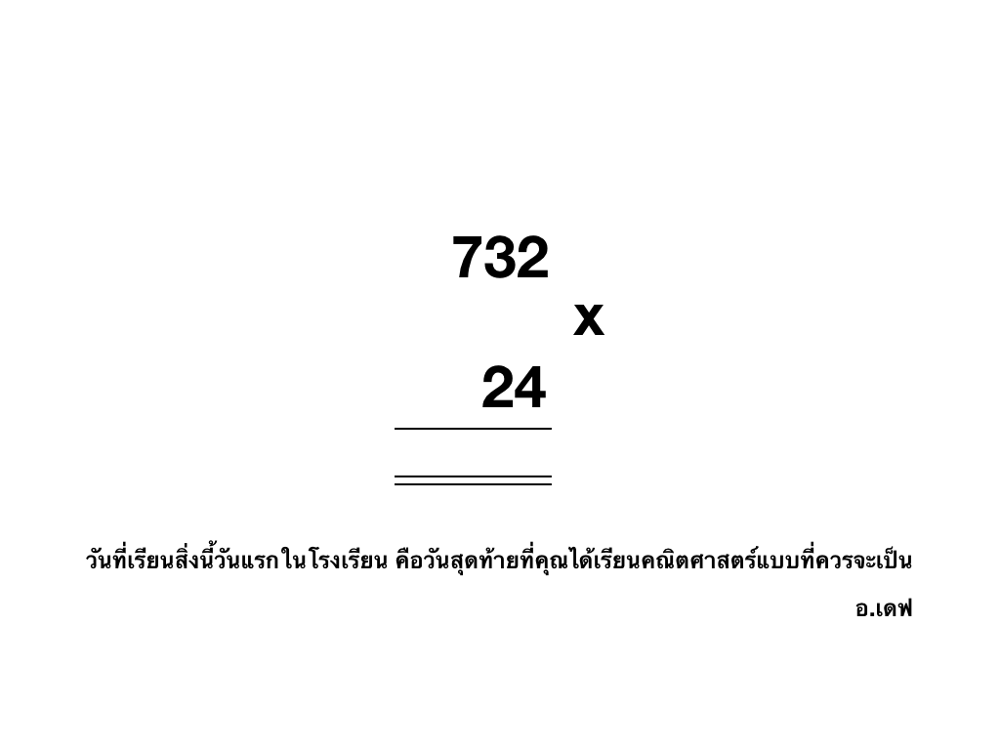
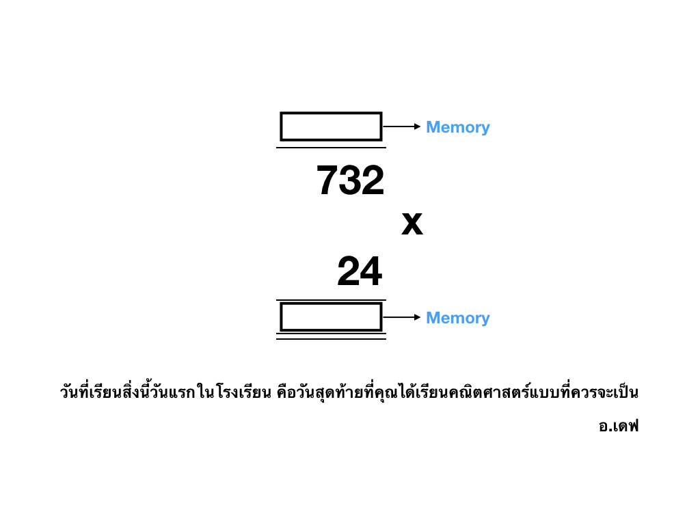

<!-- note
😍
-->

<!-- classes: fullscreen -->

import { Img } from '@fusuma/client';

</Img>

<footer class="footer-credit">
  

    <a href="https://en.wikipedia.org/wiki/Separation_of_concerns">
      Credit: https://en.wikipedia.org/wiki/Separation_of_concerns
    </a>
  

</footer>

---
<!-- note
ความล้มเหลวในการเข้าใจอย่างถูกต้องและสมบูรณ์;

ความคิดหรือความเชื่อที่ไม่ถูกต้องซึ่งเป็นผลมาจากความล้มเหลว
-->

# misappreciation

#### A failure to correctly and completely understand; an incorrect notion or belief that is a result of such a failure.

---
#### computing

# community

---
import { Card } from '@fusuma/client';

<Card
  left={}
  right={}
/>

<footer class="footer-credit">
  

    <a href="https://unsplash.com/photos/GBEHjsPQbEQ">
      Photo by Andre Mouton on Unsplash
    </a>
  

  

    <a href="https://unsplash.com/photos/sf_1ZDA1YFw">
      Photo by Mike Dorner on Unsplash
    </a>
  

</footer>

---
<!-- classes: fullscreen -->

</Img>

<footer class="footer-credit">
  

    <a href="https://unsplash.com/photos/jG1z5o7NCq4">
      Photo by Mario Purisic on Unsplash
    </a>
  

</footer>

---
<!-- classes: fullscreen -->

</Img>

---
<!-- classes: fullscreen -->

</Img>

---
<!-- classes: fullscreen -->

</Img>

---
# 3 x 4 = 4 x 3

---
<!-- classes: fullscreen -->

</Img>

<footer class="footer-credit">
  

    <a href="https://unsplash.com/photos/FoeoheZa0gQ">
      Photo by The Framed Bear on Unsplash
    </a>
  

</footer>

---
<!-- note
The proper technique is clearly to postpone the concerns for general acceptance until you have reached a result of such a quality that it deserves acceptance. It is the significance of your message that should justify the care that you give to its presentation, it may be its "unusualness" that makes extra care necessary. And, secondly, what is "general"? Has Albert Einstein failed because the Theory of Relativity is too difficult for the average highschool student?
-->

# What is "general"?

#### "general acceptance"

---

# Fifteen years later

#### It was evident the term Separation of Concerns was becoming an accepted idea.

#### In 1989

<footer class="footer-credit">
  

    <a href="https://en.wikipedia.org/wiki/Separation_of_concerns">
      Credit: https://en.wikipedia.org/wiki/Separation_of_concerns
    </a>
  

</footer>

---
# Chris Reade wrote a book titled

# "Elements of Functional Programming"

#### that describes separation of concerns: 

<footer class="footer-credit">
  

    <a href="https://en.wikipedia.org/wiki/Separation_of_concerns">
      Credit: https://en.wikipedia.org/wiki/Separation_of_concerns
    </a>
  

</footer>

---
<!-- note
😍ให้นิยามว่าเราต้องการ compute อะไร คืองานของเรา

go concurrency ตอนเขียนก็สั่ง go นำหน้าแค่นั้น
-->

<Card
  left={}
  right={
    <>
      
<b>The programmer is having to do several things at the same time, namely,</b>

      <ul>
        <li>describe what is to be computed;</li>
        <li>organise the computation sequencing into small steps;</li>
        <li>organise memory management during the computation.</li>
      </ul>
    </>
  }
/>

<footer class="footer-credit">
  

    <a href="https://unsplash.com/photos/IClZBVw5W5A">
      Photo by Todd Quackenbush on Unsplash
    </a>
  

  

    <a href="https://en.wikipedia.org/wiki/Separation_of_concerns">
      Credit: https://en.wikipedia.org/wiki/Separation_of_concerns
    </a>
  

</footer>
