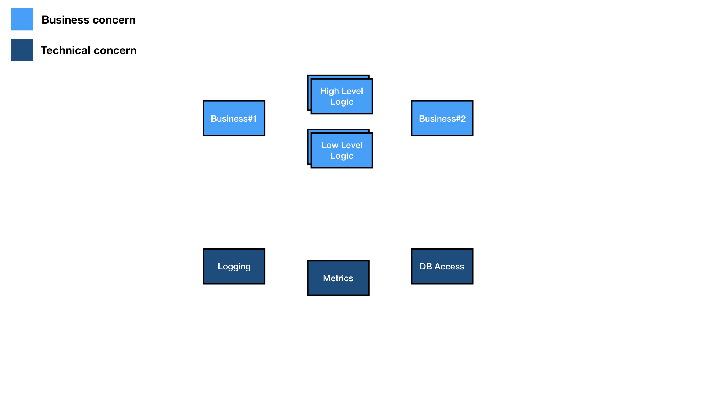
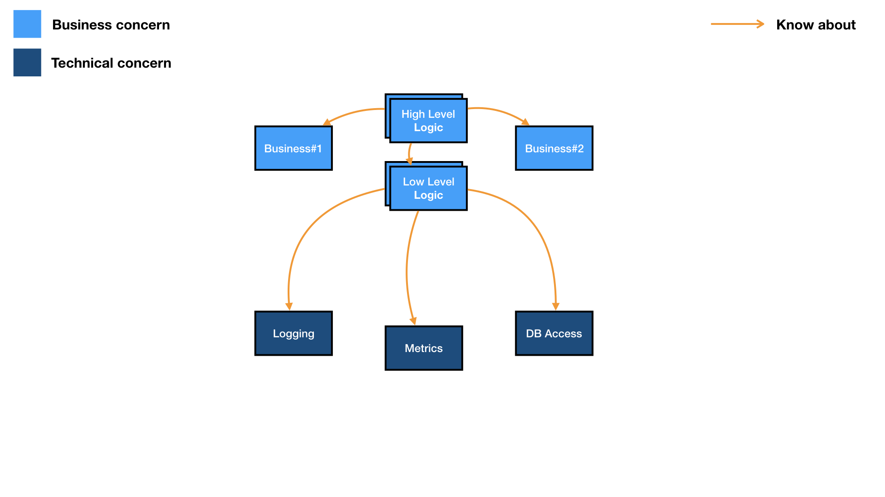
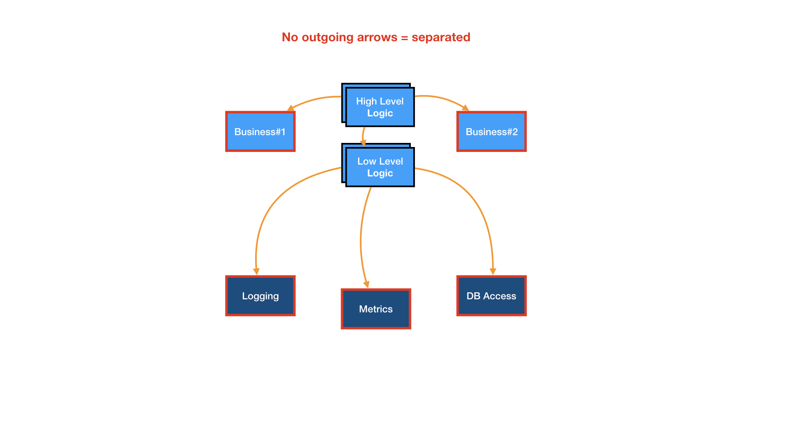

# Intelligent thinking

<blockquote>
  
 
    It is, that one is willing to study in depth an aspect of one's subject matter in isolation for the sake of its own consistency, all the time knowing that one is occupying oneself only with one of the aspects
  

  
— Edsger W. Dijkstra

</blockquote>

---
import { Img } from '@fusuma/client';

</Img>

<footer class="footer-credit">
  

    <a href="https://www.youtube.com/watch?v=-jlLkTtgWUk">
      Lambda Days 2018 - Michal Plachta - Freestyle, Free & Tagless: separation of concerns on steroids
    </a>
  

</footer>

---

</Img>

<footer class="footer-credit">
  

    <a href="https://www.youtube.com/watch?v=-jlLkTtgWUk">
      Lambda Days 2018 - Michal Plachta - Freestyle, Free & Tagless: separation of concerns on steroids
    </a>
  

</footer>

---

</Img>

<footer class="footer-credit">
  

    <a href="https://www.youtube.com/watch?v=-jlLkTtgWUk">
      Lambda Days 2018 - Michal Plachta - Freestyle, Free & Tagless: separation of concerns on steroids
    </a>
  

</footer>
